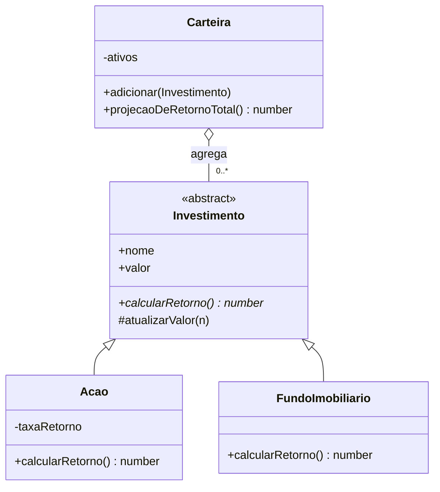
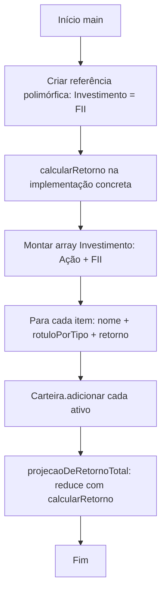

# OOP no exemplo 1 (carteira de investimentos)

Este projeto é uma introdução enxuta: uma hierarquia de **investimentos**, uso **polimórfico** da interface da classe base e **composição** na carteira. Os arquivos estão em `src/domain/` e o fluxo principal em `src/app.ts`.

## Onde cada pilar aparece

| Pilar | Onde no código |
|--------|-----------------|
| **Abstração** | `Investimento` define o contrato (`nome`, `valor`, `calcularRetorno()`) e esconde como o valor é atualizado (`atualizarValor` é `protected`). |
| **Encapsulamento** | `#valor` em `investimento.ts` (campo privado de verdade em runtime); validação em `#exigePositivo`; `Carteira` guarda `#ativos` e só expõe `adicionar`, `projecaoDeRetornoTotal`, etc. |
| **Herança** | `Acao` e `FundoImobiliario` estendem `Investimento` e chamam `super()` no construtor. |
| **Polimorfismo** | Variável `Investimento` ou array `Investimento[]`: em tempo de execução chama-se `calcularRetorno()` da subclasse correta; `app.ts` também usa `instanceof` para rotular o tipo. |
| **Composição** | `Carteira` **tem** vários `Investimento` (agregação): não é herança; a carteira delega o cálculo para cada ativo. |

## Diagrama de classes (visão geral)

## Fluxograma do `app.ts`

## Leitura sugerida na ordem

1. `investimento.ts` — base abstrata e encapsulamento do valor  
2. `acao.ts` e `fundo-imobiliario.ts` — especializações  
3. `carteira.ts` — composição e polimorfismo na agregação  
4. `app.ts` — encenação dos conceitos no console  
