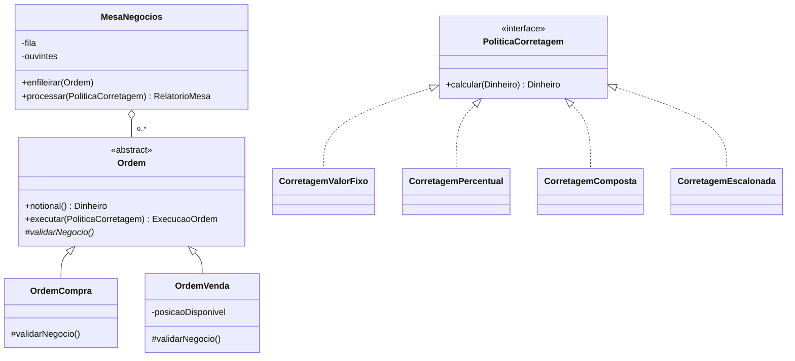
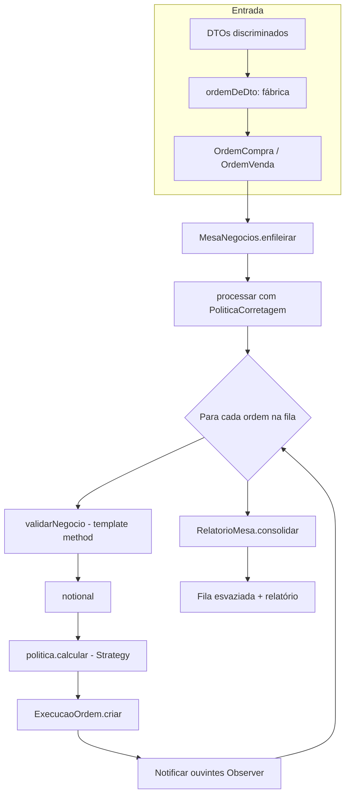

# OOP no exemplo 2 (mesa de negociação)

Este exemplo vai além dos quatro pilares clássicos: combina **objeto de valor** (`Dinheiro`), **template method** na ordem, **Strategy** na corretagem, **Observer** na mesa e uma **fábrica** que monta ordens a partir de DTOs. Tudo em `src/domain/` e `src/aplicacao/`, com entrada em `src/app.ts`.

## Onde cada pilar aparece

| Pilar | Onde no código |
|--------|-----------------|
| **Abstração** | `Ordem` abstrata: fluxo comum `notional()` + `executar(politica)`; `validarNegocio()` é o gancho por subclasse. Interface `PoliticaCorretagem` abstrai *como* calcular a taxa. |
| **Encapsulamento** | `Dinheiro`: construtor privado e `#centavos`; `ExecucaoOrdem` e `RelatorioMesa` com construtores privados e fábricas estáticas; `MesaNegocios` com `#fila` e `#ouvintes`. |
| **Herança** | `OrdemCompra` e `OrdemVenda` estendem `Ordem`; políticas de corretagem implementam a mesma interface (não há classe base comum além da interface). |
| **Polimorfismo** | `politica.calcular(notional)` — `CorretagemValorFixo`, `CorretagemPercentual`, `CorretagemComposta`, `CorretagemEscalonada` intercambiáveis. `ordem.executar(politica)` com `Ordem` referenciando compra ou venda. `fluxoDeCaixaCliente()` em `ExecucaoOrdem` ramifica por `tipo` sem polimorfismo de subclasse na execução (valor agregado), mas as **ordens** sim especializam validação. |

## Diagrama de classes (visão geral)

## Fluxograma: da fila ao relatório

## Leitura sugerida na ordem

1. `dinheiro.ts` — valor encapsulado e imutável  
2. `corretagem.ts` — interface e estratégias compostas / escalonadas  
3. `ordem.ts`, `ordem-compra.ts`, `ordem-venda.ts` — template method e herança  
4. `execucao-ordem.ts` — resultado da execução  
5. `mesa-negocios.ts` — fila, observer e processamento  
6. `fabrica-ordens.ts` — criação a partir do DTO  
7. `app.ts` — política institucional composta e cenário completo  
