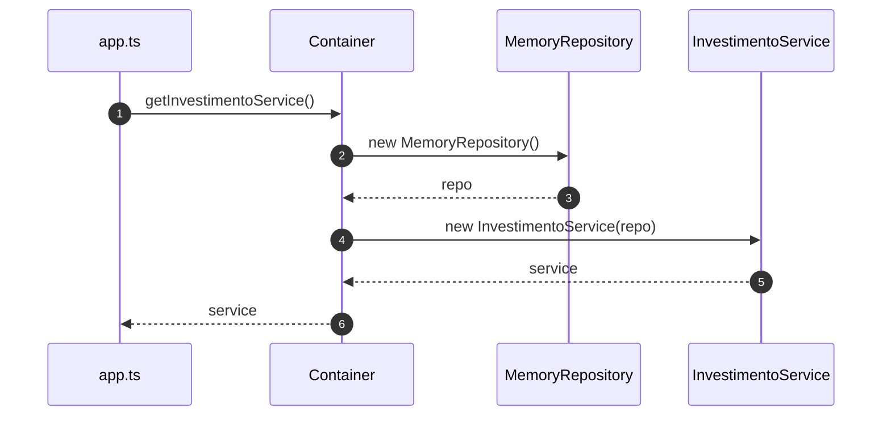
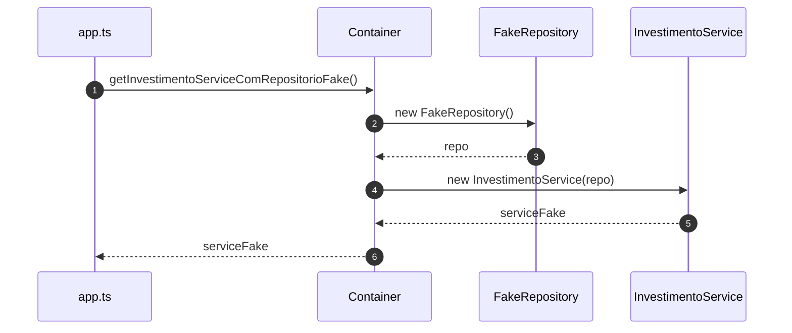
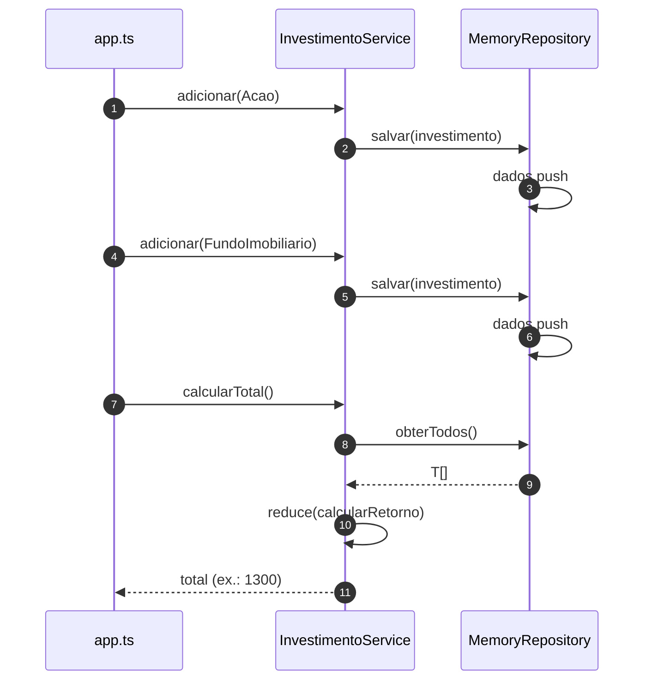
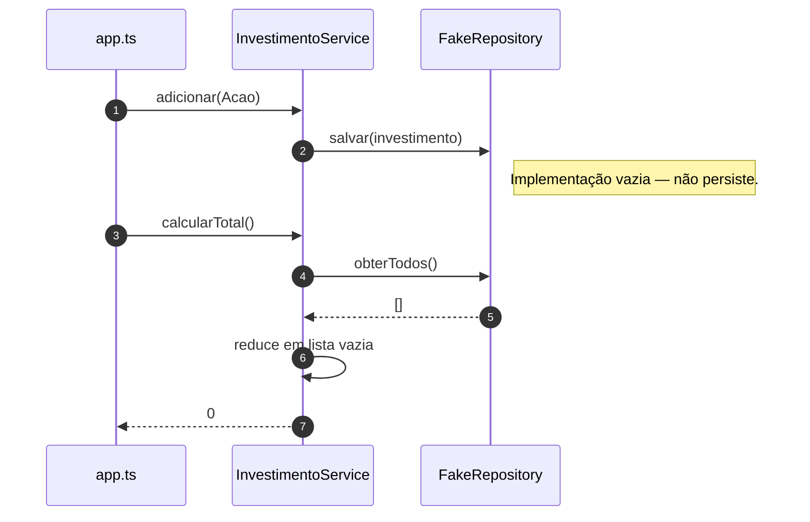

# Diagramas de sequência — Aula 3, exemplo 1 (container + DI)

Fluxos baseados em `src/app.ts`, `src/container/container.ts`, `InvestimentoService` e repositórios. Visualização: [Mermaid](https://mermaid.js.org/).

---

## 1. Composição: `Container.getInvestimentoService()`

O **container** cria `MemoryRepository` e injeta em `InvestimentoService` (ponto de **Inversão de Controle** na montagem).

---

## 2. `getInvestimentoServiceComRepositorioFake()`

Mesmo serviço de domínio; só a **implementação** de `Repository` muda (composição no container).

---

## 3. Fluxo com `MemoryRepository`: `adicionar` e `calcularTotal`

---

## 4. Fluxo com `FakeRepository`: `adicionar` não altera leitura

`salvar` é no-op; `obterTodos` retorna `[]`, então o total fica **0**.

---

## Leitura rápida

- **`InvestimentoService`** só fala com **`Repository<Investimento>`**; quem escolhe memória ou fake é o **`Container`**.
- O diagrama 3 vs 4 mostra o mesmo contrato de serviço com **comportamentos diferentes** de persistência.
