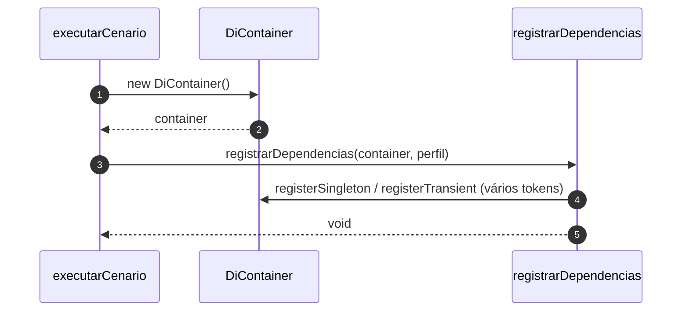
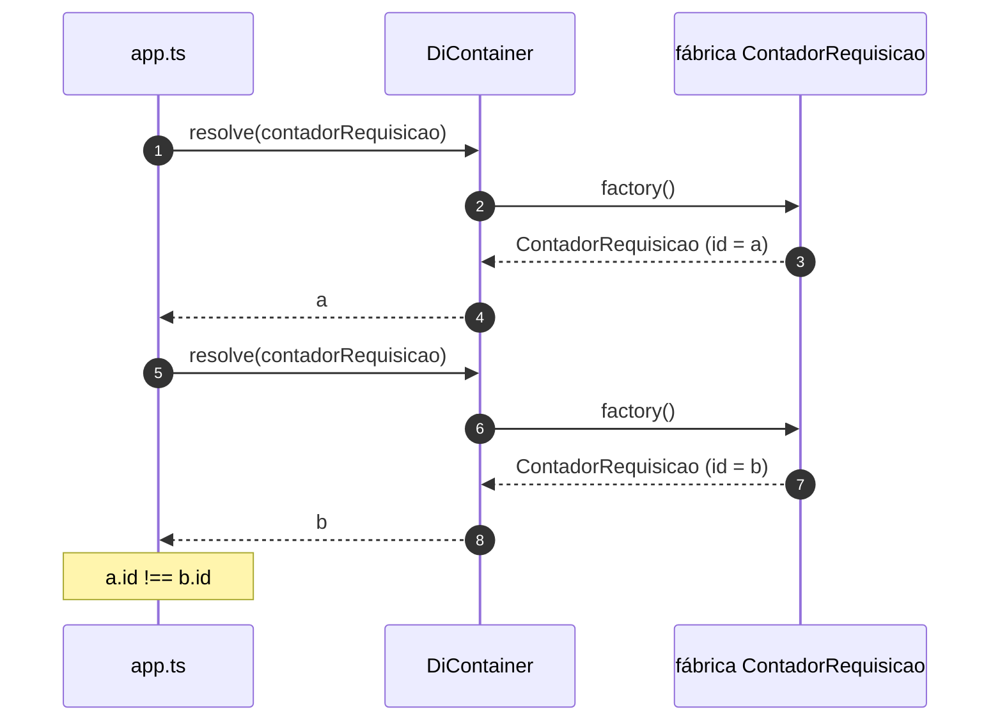
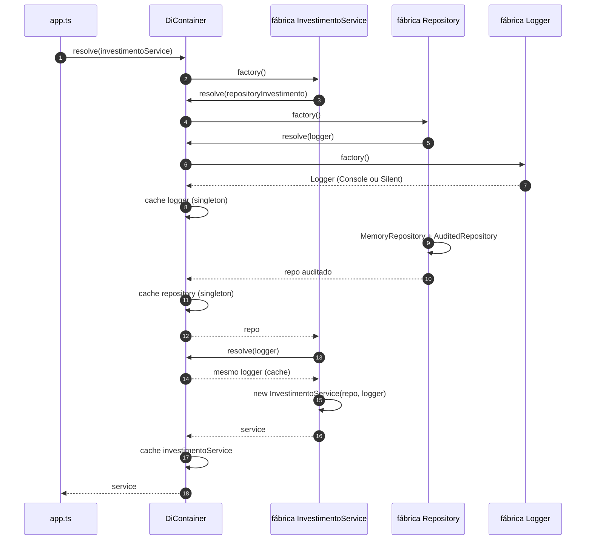
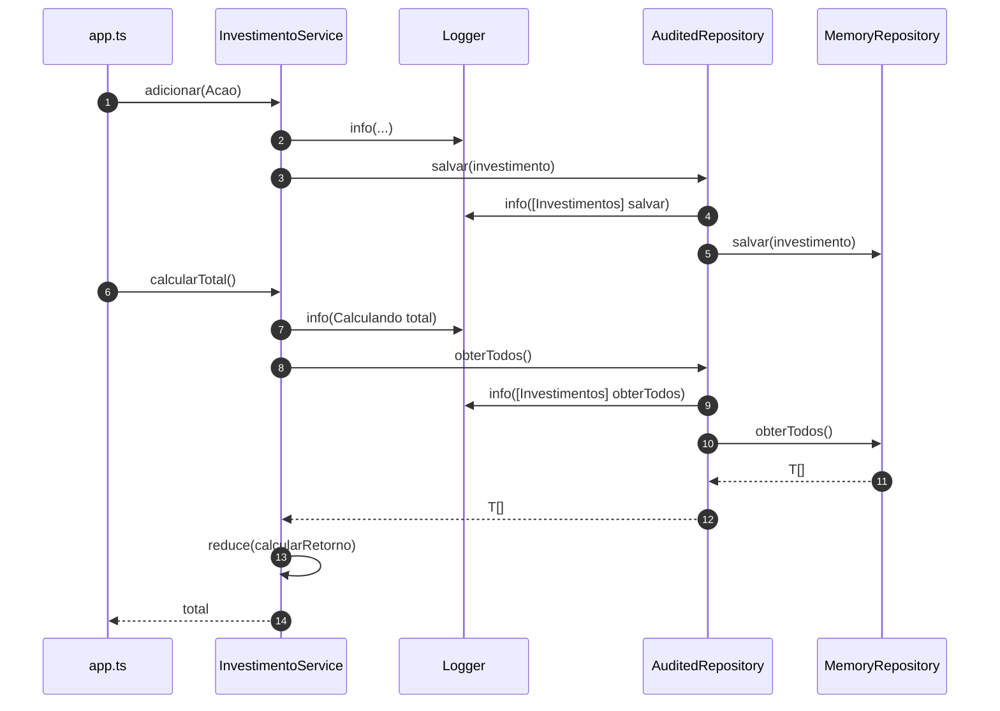
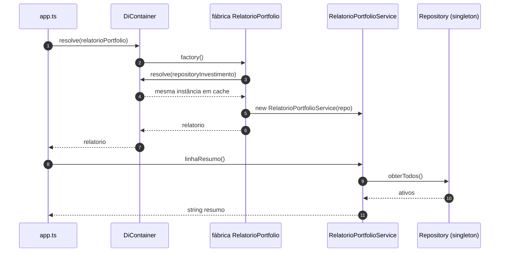

# Diagramas de sequência — Aula 3, exemplo 2 (`DiContainer` + composition root)

Fluxos baseados em `src/app.ts`, `composition/registrar-dependencias.ts` e `core/di-container.ts`. Visualização: [Mermaid](https://mermaid.js.org/).

---

## 1. Abertura de cenário: container e registro

`executarCenario` cria um **`DiContainer` novo por cenário** e chama **`registrarDependencias`**, que só associa **tokens** a **fábricas** (singleton ou transient).

---

## 2. `ContadorRequisicao` (transient): duas resoluções, duas instâncias

Cada **`resolve`** chama a fábrica registrada com **`registerTransient`** sem cache.

---

## 3. Primeiro `resolve(InvestimentoService)` (singletons encadeados)

A fábrica do serviço pede **repositório** e **logger**. A fábrica do **repositório auditado** pede o **logger** e envolve **`MemoryRepository`**.

Segunda chamada a **`resolve(investimentoService)`** (se existisse) devolveria a **mesma** instância em cache.

---

## 4. `adicionar` e `calcularTotal` no serviço

---

## 5. `RelatorioPortfolioService`: repositório compartilhado

O **mesmo singleton** de `repositoryInvestimento` é injetado no relatório; os dados incluem o que o serviço anterior persistiu.

---

## 6. Perfil `teste` e `SilentLogger`

O registro em **`registrarDependencias`** usa **`SilentLogger`** quando `perfil === "teste"`; o fluxo de `resolve` é análogo ao diagrama 3, trocando a implementação concreta do logger. No fim, **`logger.mensagens`** permite inspecionar linhas capturadas sem `console`.

---

## Leitura rápida

- **Composition root** (`registrarDependencias`) concentra **quem** implementa cada token por **perfil**.
- **Singleton vs transient** no mesmo container: repositório e serviços **compartilhados** vs contador **nova instância** a cada `resolve`.
