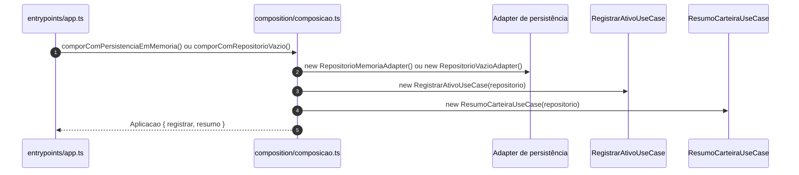
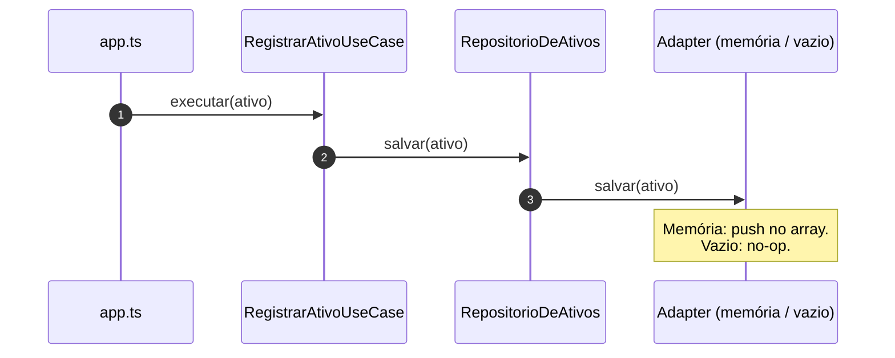
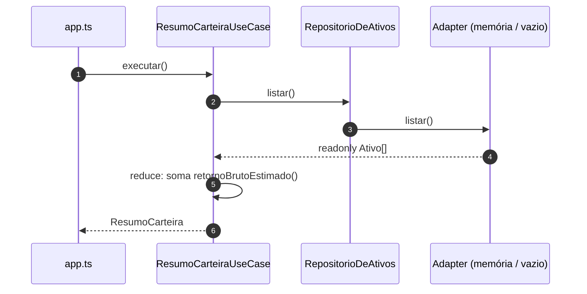

# Diagramas de sequência — Aula 5, exemplo 1 (Hexagonal)

Fluxos a partir de `src/entrypoints/app.ts`, `composition/composicao.ts`, casos de uso e adaptadores de persistência. Visualização: [Mermaid](https://mermaid.js.org/).

A mesma porta **`RepositorioDeAtivos`** é implementada por **`RepositorioMemoriaAdapter`** (cenário “real”) e **`RepositorioVazioAdapter`** (contraste: resumo zerado).

---

## 1. Composição da aplicação (DI manual)

---

## 2. Fluxo `RegistrarAtivoUseCase.executar`

---

## 3. Fluxo `ResumoCarteiraUseCase.executar`

---

## Leitura rápida

- **Driving:** o `app.ts` só enxerga **`Aplicacao`** (casos de uso compostos na raiz).
- **Driven:** persistência através da porta **`RepositorioDeAtivos`**; trocar o adaptador troca o comportamento observado no **`ResumoCarteira`** sem editar os use cases.
