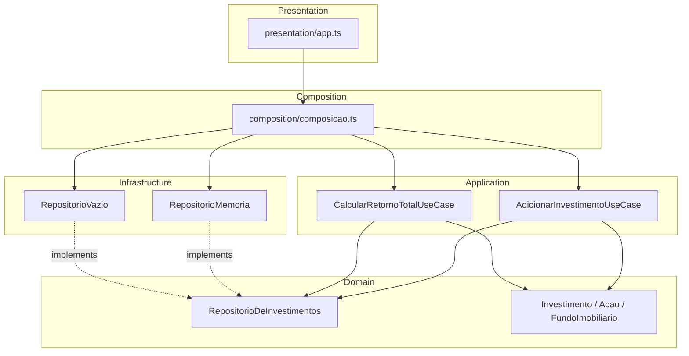
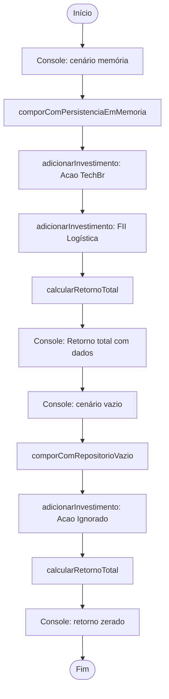
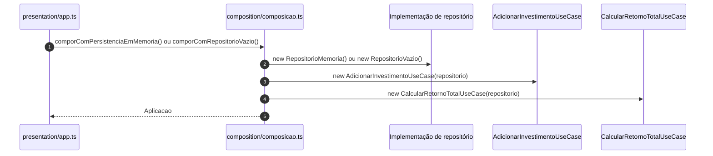
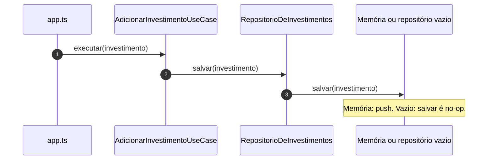
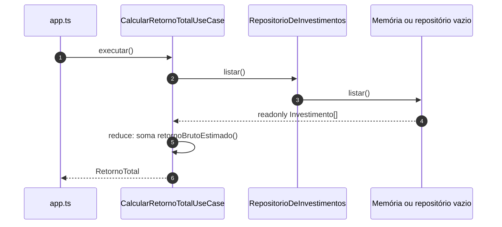

# Fluxograma e diagramas de sequência — Aula 6, exemplo 1 (Onion)

Documentação visual da **`presentation/app.ts`**, composição, casos de uso e persistência. Renderização: [Mermaid](https://mermaid.js.org/).

---

## 1. Fluxograma — camadas (cebola) e dependências

As **regras de negócio** e o contrato **`RepositorioDeInvestimentos`** ficam no **domínio**. Casos de uso dependem só do domínio. **Infraestrutura** implementa o contrato. **Composição** conecta tudo; **presentation** só orquestra o demo.

**Leitura:** setas de **código-fonte** apontam de fora para dentro (aplicação depende de abstrações do núcleo). **Infraestrutura** “aponta” para o domínio ao satisfazer a interface (inversão em relação ao fluxo de controle em runtime).

---

## 2. Fluxograma — execução do programa (`app.ts`)

Dois cenários com **os mesmos casos de uso** e **repositórios diferentes**.

---

## 3. Diagrama de sequência — composição (DI manual)

---

## 4. Diagrama de sequência — `AdicionarInvestimentoUseCase.executar`

---

## 5. Diagrama de sequência — `CalcularRetornoTotalUseCase.executar`

---

## Resumo

| Artefato | O que mostra |
|----------|----------------|
| **§1** | Onde cada pasta se encaixa na cebola e quem implementa **`RepositorioDeInvestimentos`**. |
| **§2** | Ordem dos **dois demos** no CLI. |
| **§3–§5** | Mensagens trocadas entre **presentation**, **use cases** e **persistência** em runtime. |
