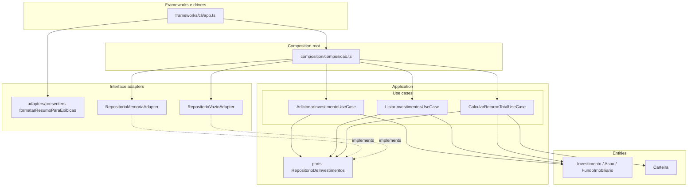
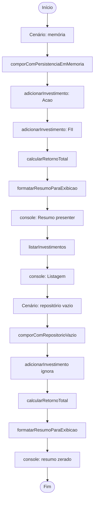
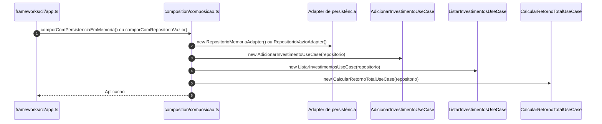
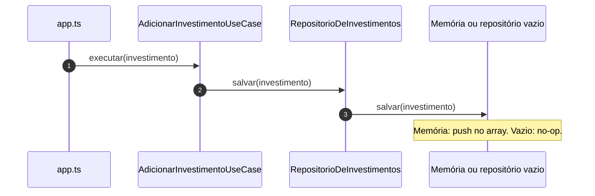
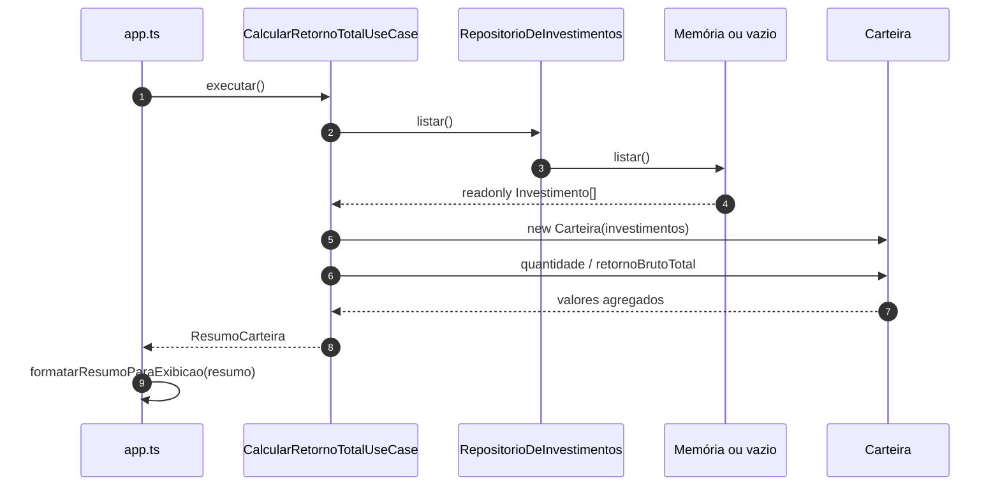
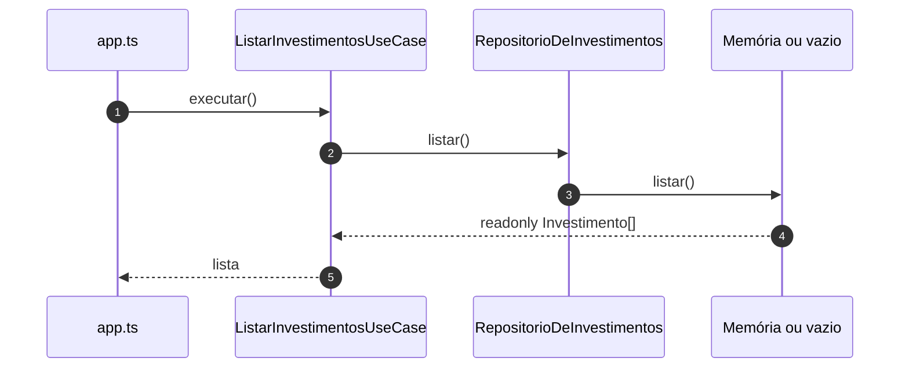

# Fluxogramas e diagramas de sequência — Aula 7

Documentação visual do projeto **`aula7/exemplo1`** (Arquitetura Limpa em TypeScript). Renderização: [Mermaid](https://mermaid.js.org/).

O ponto de entrada é **`src/frameworks/cli/app.ts`**, que compõe a aplicação, executa casos de uso e usa o **presenter** para exibir o resumo.

---

## 1. Fluxograma — camadas (Clean Architecture)

Dependências de **implementação** apontam para o interior: **entities** e **use cases** não conhecem CLI nem detalhes de persistência; **adapters** implementam portas e formatam saída.

**Presenter:** o CLI chama `calcularRetornoTotal.executar()` e em seguida `formatarResumoParaExibicao(resumo)` — o **fluxo de dados** vai do use case para o presenter, sem o presenter depender da classe do use case (apenas do tipo `ResumoCarteira`).

---

## 2. Fluxograma — execução do `app.ts`

Dois cenários: repositório em **memória** (listagem e resumo preenchidos) e repositório **vazio** (adicionar não persiste; resumo zerado).

---

## 3. Diagrama de sequência — composição (`criarAplicacao`)

---

## 4. Diagrama de sequência — `AdicionarInvestimentoUseCase.executar`

---

## 5. Diagrama de sequência — `CalcularRetornoTotalUseCase.executar`

---

## 6. Diagrama de sequência — `ListarInvestimentosUseCase.executar`

---

## Resumo

| Seção | Conteúdo |
|-------|-----------|
| **1** | Mapa de pastas alinhado à **Clean Architecture** deste repositório. |
| **2** | Ordem real dos logs no **CLI** (dois cenários). |
| **3–6** | Interação **composition → use cases → porta → adapter** e uso de **Carteira** + **presenter**. |

Implementação: **`aula7/exemplo1/`**.
