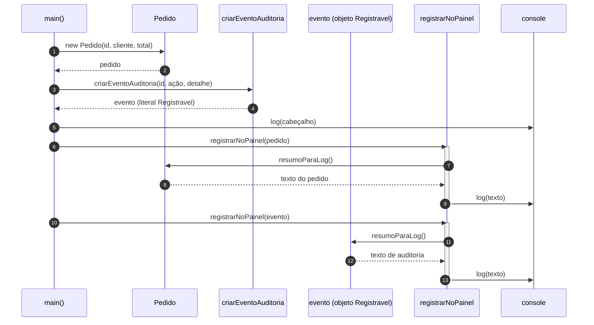

# Diagrama de sequência — exemplo1 (interface `Registravel`)

Fluxo de `src/app.ts`: montagem dos itens que cumprem `Registravel`, mensagem inicial no console e, para cada item, `registrarNoPainel` delegando em `resumoParaLog()`.

## Leitura do diagrama

1. **`main`** constrói um **`Pedido`** e um objeto devolvido por **`criarEventoAuditoria`**, ambos usáveis onde se espera **`Registravel`**.
2. **`registrarNoPainel`** só usa o contrato da interface: chama **`resumoParaLog()`** e manda o texto para o **`console`**.
3. No segundo item, **`resumoParaLog`** roda no **objeto literal** produzido pela factory (participante **evento**), não na classe `Pedido`.

Para visualizar o gráfico, abra este arquivo em um ambiente com suporte a [Mermaid](https://mermaid.js.org/) (por exemplo, pré-visualização Markdown no VS Code/Cursor com extensão Mermaid, ou GitHub ao publicar o repositório).
