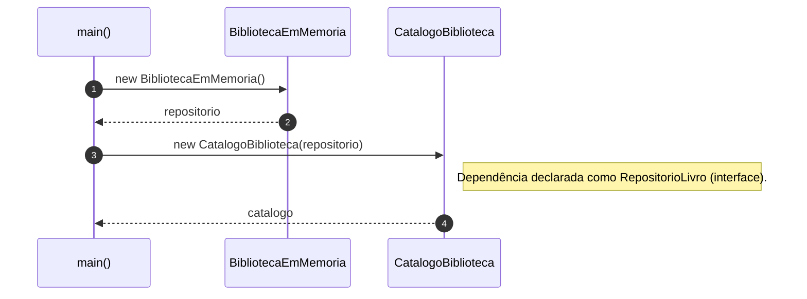
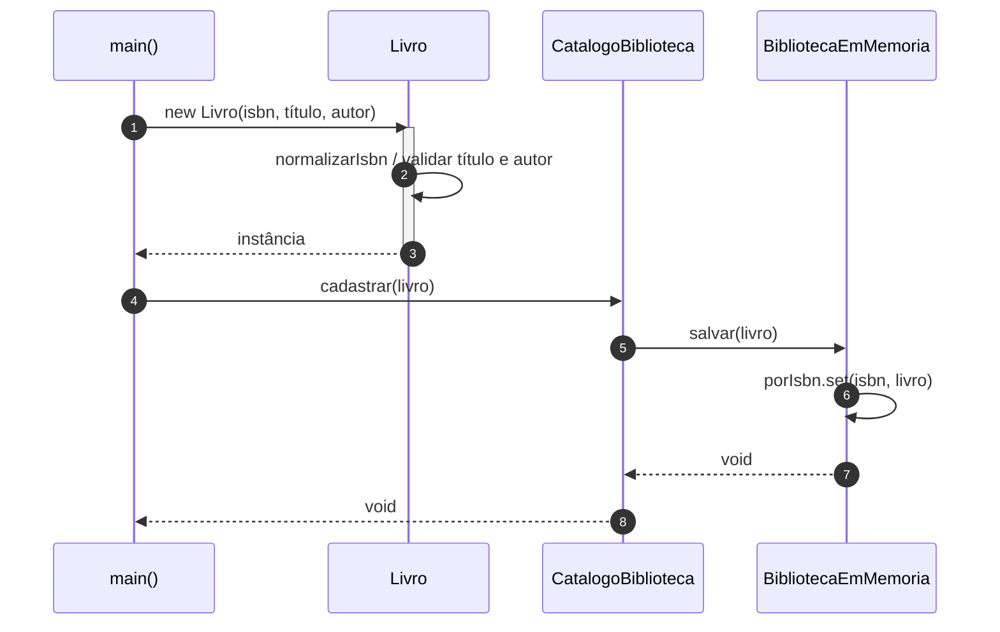
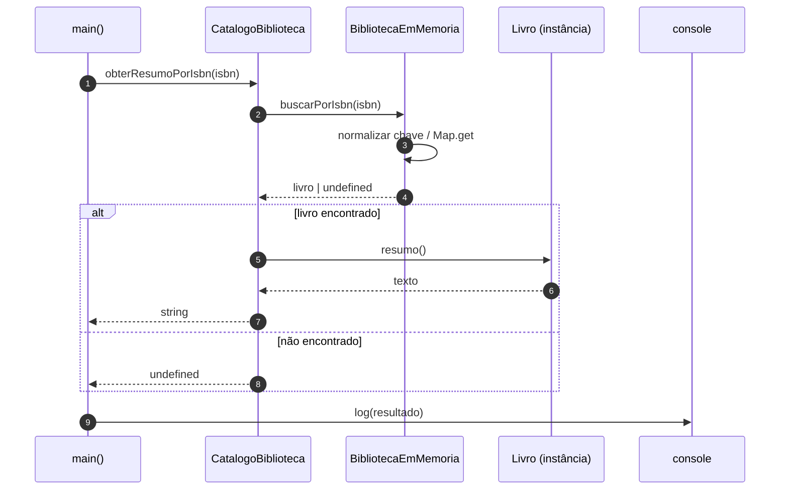

# Diagramas de sequência — exemplo2 (OOP + interface `RepositorioLivro`)

Fluxos derivados de `src/app.ts`, `CatalogoBiblioteca`, `BibliotecaEmMemoria` e `Livro`. Visualização: [Mermaid](https://mermaid.js.org/) (GitHub, extensões de Markdown no editor).

---

## 1. Inicialização

---

## 2. Cadastro de um livro (`cadastrar` → `salvar`)

O fluxo repete para cada `catalogo.cadastrar(...)` no `app.ts`.

---

## 3. Consulta por ISBN (`obterResumoPorIsbn` → `buscarPorIsbn` → `resumo`)

Caminho em que o livro é encontrado (`encontrado` não é `undefined`):

---

## Leitura rápida

- **Interface** `RepositorioLivro`: `CatalogoBiblioteca` só conversa com esse contrato; não referencia `BibliotecaEmMemoria` por tipo.
- **OOP**: `Livro` encapsula regras de criação; `BibliotecaEmMemoria` encapsula o `Map` e a forma de indexar por ISBN.
