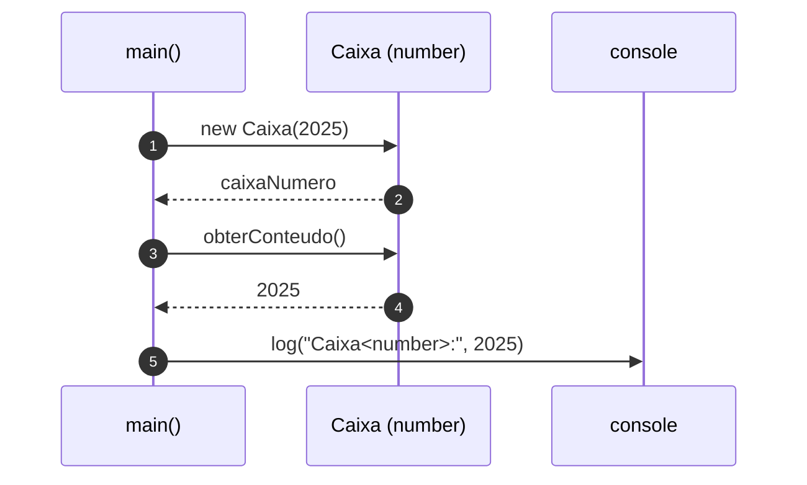
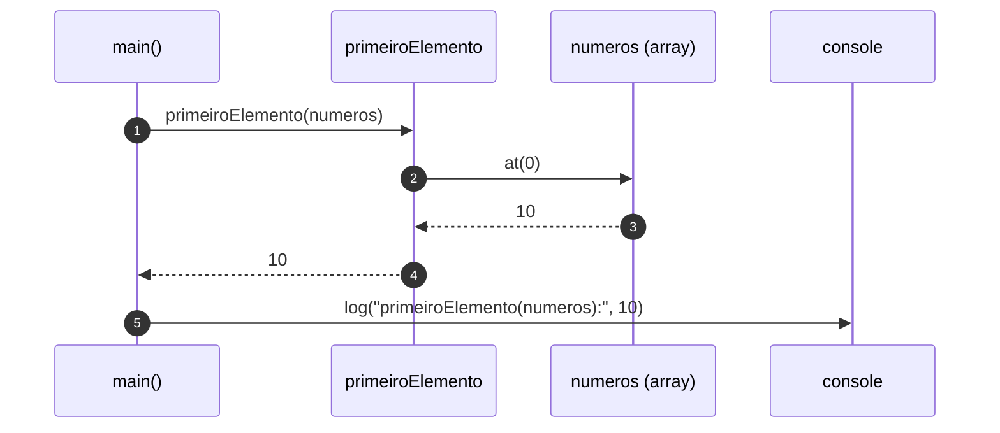
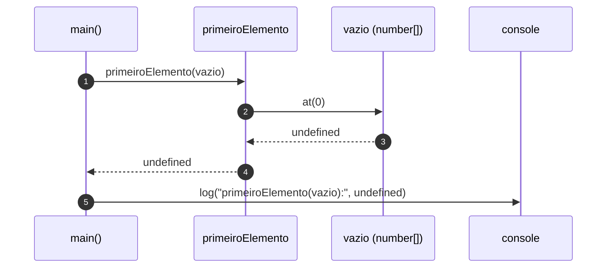

# Diagrama de sequência — exemplo3 (generics: `Caixa<T>` e `primeiroElemento`)

Fluxos baseados em `src/app.ts`. Visualização: [Mermaid](https://mermaid.js.org/) (GitHub, preview Markdown no editor).

---

## 1. `Caixa<T>` — construir e ler o conteúdo

Exemplo representativo: `new Caixa(2025)` e `obterConteudo()` antes do `console.log` (o mesmo padrão vale para `string` e `Ponto`).

---

## 2. `primeiroElemento<T>` — array com itens

Exemplo: `primeiroElemento([10, 20, 30])`.

---

## 3. `primeiroElemento<T>` — array vazio

Quando não há índice `0`, `at(0)` devolve `undefined`.

---

## Leitura rápida

- **Genéricos** não aparecem em tempo de execução no JavaScript: o diagrama mostra o fluxo **concreto** (chamadas e retornos). O `T` garante **tipos** em tempo de compilação (por exemplo, `Caixa<number>.obterConteudo()` é `number`).
- **`Caixa<T>`** encapsula um valor de tipo `T`; **`primeiroElemento<T>`** reutiliza a mesma função para qualquer elemento de array `T`.
