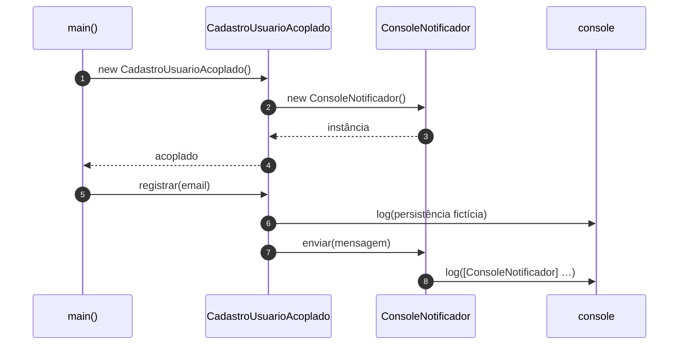
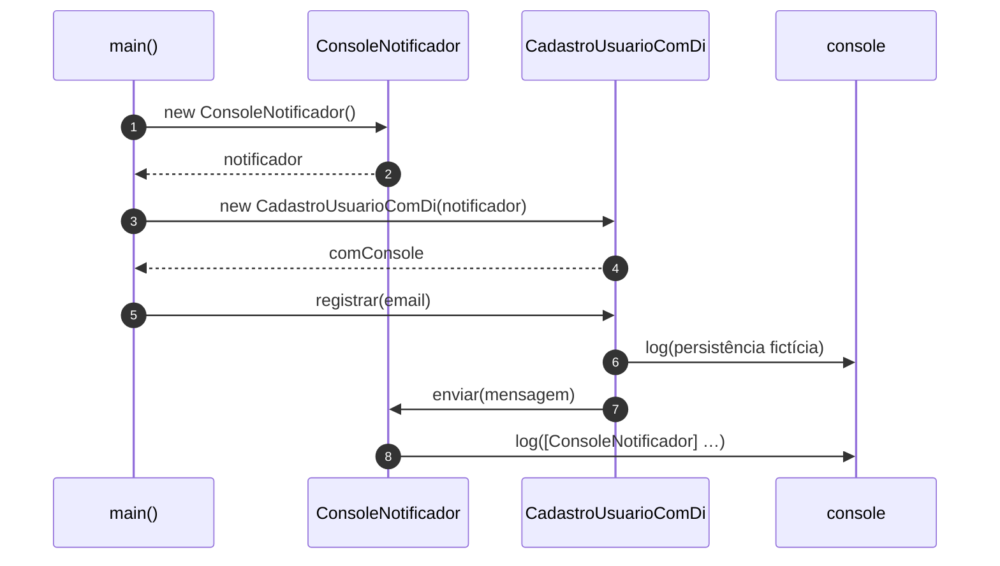
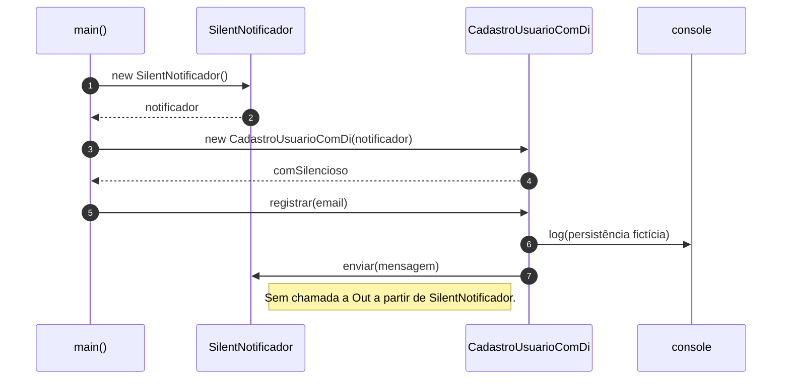

# Diagramas de sequência — exemplo1 (acoplamento vs DI)

Fluxos baseados em `src/app.ts` e nas classes de cadastro. Visualização: [Mermaid](https://mermaid.js.org/).

---

## 1. Cenário acoplado (`CadastroUsuarioAcoplado`)

A dependência concreta é criada **dentro** da classe (campo `notificador`).

---

## 2. DI com `ConsoleNotificador` (`CadastroUsuarioComDi`)

Quem compõe o grafo de objetos (**`main`**) cria o `ConsoleNotificador` e **injeta** no construtor.

---

## 3. DI com `SilentNotificador` (mesma classe de negócio)

`CadastroUsuarioComDi` não muda; só a implementação de `Notificador` injetada muda. `enviar` não escreve no `console`.

---

## Leitura rápida

- **Acoplado**: `CadastroUsuarioAcoplado` **conhece** e **instancia** `ConsoleNotificador` — diagrama 1 mostra o `new` dentro do ciclo de vida do cadastro.

- **DI**: `CadastroUsuarioComDi` só chama a **interface** `Notificador`; os diagramas 2 e 3 diferem apenas no objeto criado em `main` antes do construtor.
