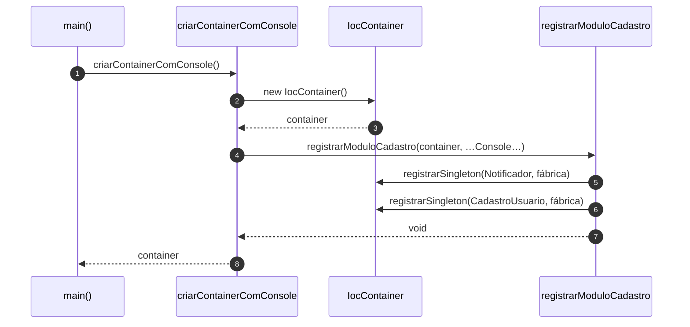
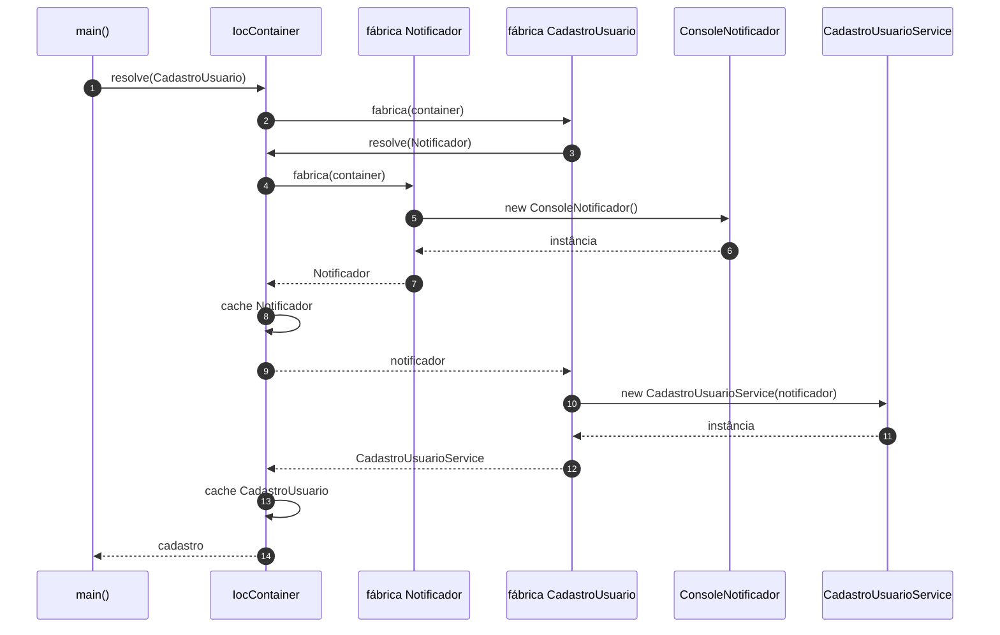
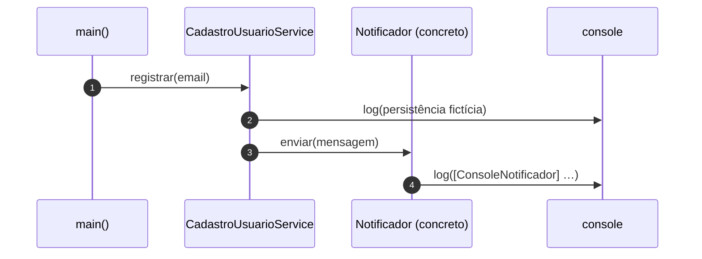

# Diagramas de sequência — exemplo2 (IoC com `IocContainer`)

Fluxos baseados em `src/app.ts`, `registrar-modulo-app.ts` e `ioc/container.ts`. Visualização: [Mermaid](https://mermaid.js.org/).

---

## 1. Composição: criar container e registrar fábricas

`criarContainerComConsole()` cria o `IocContainer` e chama `registrarModuloCadastro`, que só **registra** fábricas (ainda não instancia serviços).

---

## 2. `resolve(CadastroUsuario)` — primeiro uso (montagem lazy)

Ao resolver o token `CadastroUsuario`, o container executa a fábrica, que antes resolve `Notificador`. As duas instâncias ficam em cache (singleton).

---

## 3. Caso de uso: `cadastro.registrar(email)`

Igual ao fluxo de negócio do exemplo1 (DI): persistência fictícia + notificação.

Com `SilentNotificador`, o passo `Notif -> Out` não ocorre.

---

## 4. Segundo cenário: só muda o registro do `Notificador`

`main` cria outro `IocContainer`, chama `registrarModuloCadastro(outro, () => new SilentNotificador())` e de novo `resolve(CadastroUsuario)`. O diagrama 2 fica o mesmo em forma, trocando `ConsoleNotificador` por `SilentNotificador`; **`CadastroUsuarioService` não é alterado**.

---

## Leitura rápida

- **IoC** aqui: o **controle de criação** das dependências está no **container** e nas **fábricas registradas**, não espalhado em `new` pelo `app`.
- **`resolve`**: ponto em que o grafo de objetos é **materializado** (com singleton em memória após a primeira resolução).
