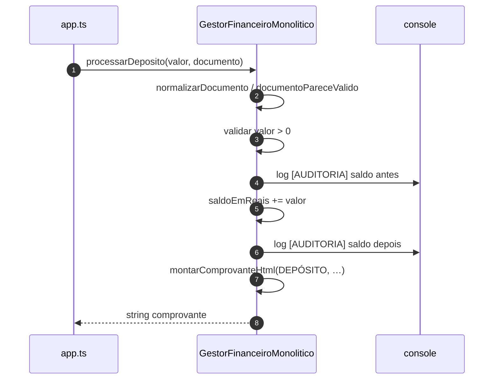
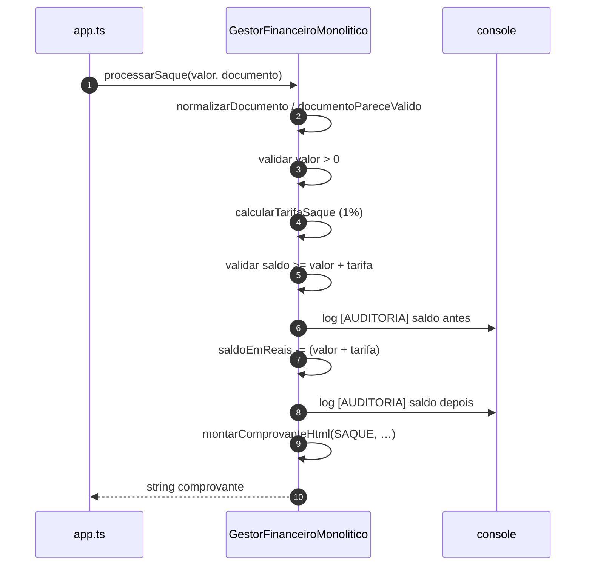

# Diagramas de sequência — exemplo1 (SRP violado, classe monolítica)

Fluxos de `src/app.ts` → `GestorFinanceiroMonolitico`. Visualização: [Mermaid](https://mermaid.js.org/).

Toda a lógica (validação, saldo, tarifa, auditoria, comprovante) ocorre **dentro da mesma classe** — por isso o diagrama mostra recursão lógica no participante **Gestor**.

---

## 1. Fluxo `processarDeposito`

---

## 2. Fluxo `processarSaque`

---

## Leitura rápida

Qualquer mudança em **formato do comprovante**, **regra de tarifa** ou **texto de auditoria** exige editar **a mesma classe** — vários motivos distintos para alteração (anti-SRP).
