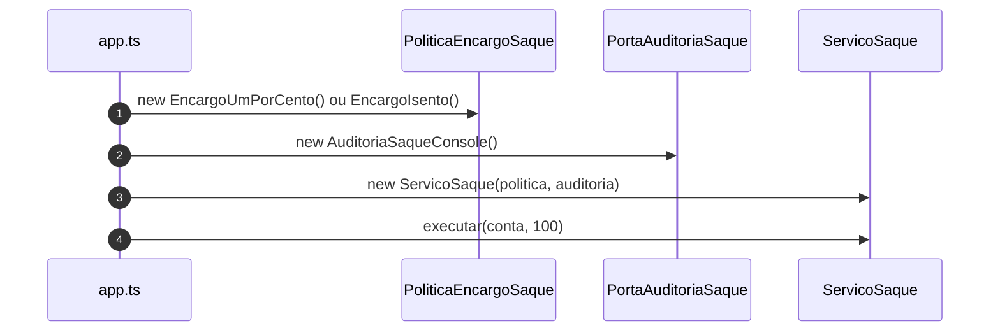
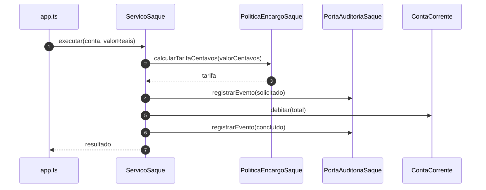

# Diagramas de sequência — exemplo10 (DIP)

Fluxo de `src/app.ts` → **`ServicoSaque`** com política e auditoria **injetadas**. Visualização: [Mermaid](https://mermaid.js.org/).

---

## 1. Composição na borda (`main` / `demo`)

---

## 2. `ServicoSaque.executar` (só abstrações)

---

## Leitura rápida

- **Quem conhece concretos** é a **borda** (`app.ts`). O **núcleo** (`ServicoSaque`) permanece estável ao trocar `EncargoUmPorCento` por `EncargoIsento` ou `AuditoriaSaqueConsole` por outro adaptador.
