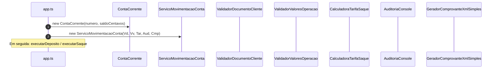
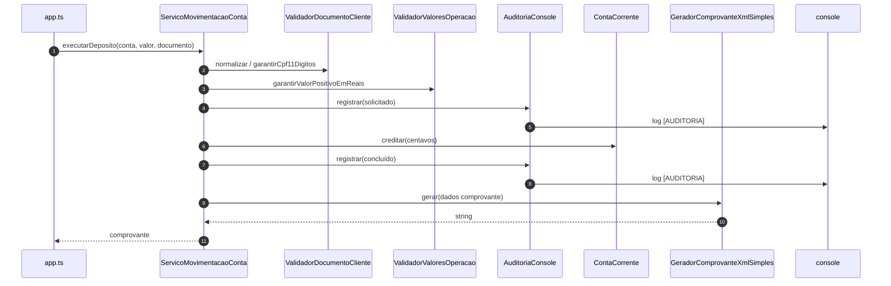
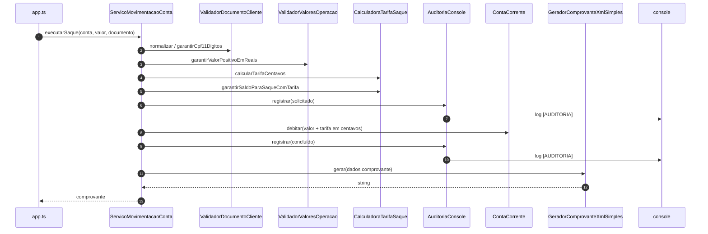

# Diagramas de sequência — exemplo2 (SRP, colaboradores)

Fluxos de `src/app.ts` e `ServicoMovimentacaoConta`. Visualização: [Mermaid](https://mermaid.js.org/).

---

## 1. Montagem do caso de uso (`main`)

Antes dos depósitos/saques, o `app` instancia **`ContaCorrente`** e injeta colaboradores em **`ServicoMovimentacaoConta`**.

---

## 2. Fluxo `executarDeposito`

---

## 3. Fluxo `executarSaque`

---

## Leitura rápida

- **ServicoMovimentacaoConta** só **coordena**; mudanças pontuais (ex.: só o layout do comprovante) concentradas em **GeradorComprovanteXmlSimples**.
- Compare com o **exemplo1**: lá não há colaboradores externos; tudo ocorre no **GestorFinanceiroMonolitico**.
