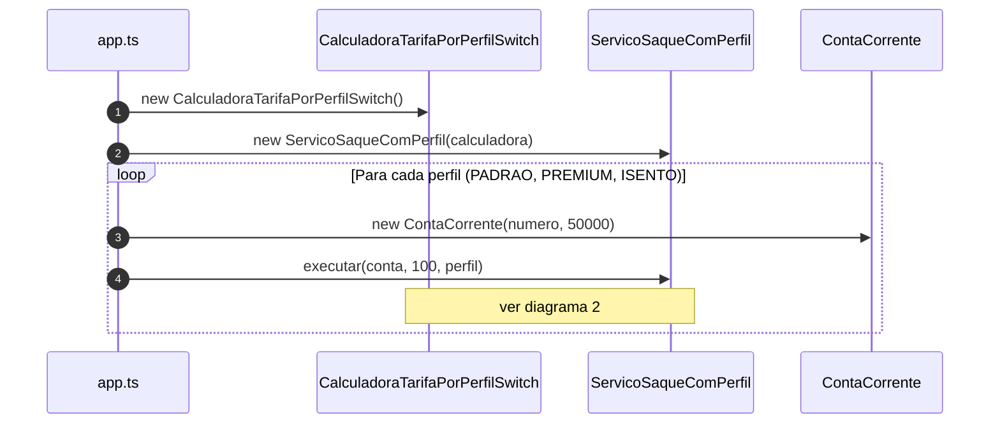

# Diagramas de sequência — exemplo3 (OCP violado, tarifa com `switch`)

Fluxos de `src/app.ts`, `demo` e `ServicoSaqueComPerfil`. Visualização: [Mermaid](https://mermaid.js.org/).

A tarifa depende de **`CalculadoraTarifaPorPerfilSwitch`** e do parâmetro **`perfil`** — novo comportamento de encargo tende a exigir **editar** o `switch` (anti-OCP).

---

## 1. Cenário `main` (três chamadas a `demo`)



---

## 2. Fluxo `ServicoSaqueComPerfil.executar`

```mermaid
sequenceDiagram
    autonumber
    participant App as app.ts / demo
    participant Svc as ServicoSaqueComPerfil
    participant Calc as CalculadoraTarifaPorPerfilSwitch
    participant Conta as ContaCorrente

    App->>Svc: executar(conta, valorReais, perfil)
    Svc->>Svc: validar valor finito e > 0
    Svc->>Svc: valorCentavos = round(valorReais * 100)
    Svc->>Calc: calcularTarifaCentavos(valorCentavos, perfil)
    Calc->>Calc: switch(perfil) → tarifa
    Calc-->>Svc: tarifaCentavos
    Svc->>Conta: obterSaldoCentavos()
    Conta-->>Svc: saldo
    Svc->>Svc: total = valorCentavos + tarifa; validar saldo
    Svc->>Conta: debitar(total)
    Svc-->>App: { tarifaCentavos, totalDebitadoCentavos }
```

---

## Leitura rápida

- O **`switch`** na calculadora **centraliza** variantes de tarifa: cada perfil novo costuma **mudar** esse arquivo e o tipo do perfil.
- No **exemplo4**, o mesmo fluxo de negócio troca `calcularTarifaCentavos(valorCentavos, perfil)` por **`politicaEncargo.calcularTarifaCentavos(valorCentavos)`** injetada no construtor do serviço.
