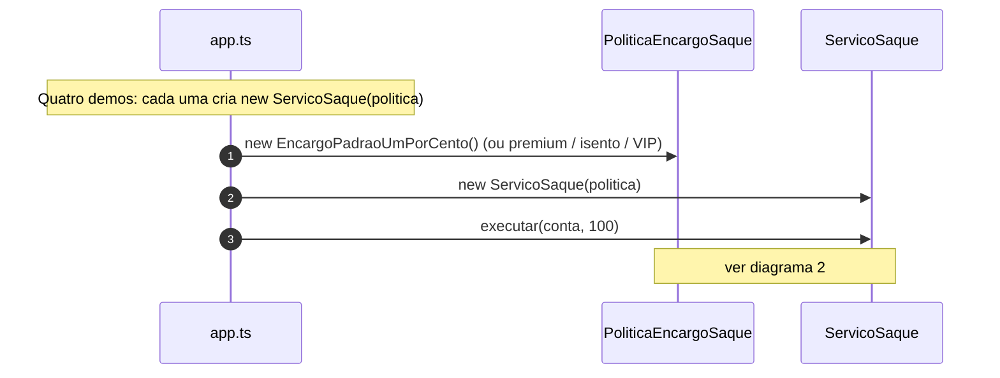

# Diagramas de sequência — exemplo4 (OCP, política de encargo)

Fluxos de `src/app.ts`, `demo` e `ServicoSaque`. Visualização: [Mermaid](https://mermaid.js.org/).

`ServicoSaque` depende só de **`PoliticaEncargoSaque`**; cada tarifa é uma **classe** (padrão, premium, isento, VIP). O diagrama usa **`EncargoPadraoUmPorCento`** como política concreta — as outras demos seguem o **mesmo** protocolo com outra implementação.

---

## 1. Cenário `main` (quatro `ServicoSaque` com políticas distintas)



---

## 2. Fluxo `ServicoSaque.executar`

```mermaid
sequenceDiagram
    autonumber
    participant App as app.ts / demo
    participant Svc as ServicoSaque
    participant Pol as PoliticaEncargoSaque
    participant Conta as ContaCorrente

    App->>Svc: executar(conta, valorReais)
    Svc->>Svc: validar valor finito e > 0
    Svc->>Svc: valorCentavos = round(valorReais * 100)
    Svc->>Pol: calcularTarifaCentavos(valorCentavos)
    Pol-->>Svc: tarifaCentavos
    Svc->>Conta: obterSaldoCentavos()
    Conta-->>Svc: saldo
    Svc->>Svc: total = valorCentavos + tarifa; validar saldo
    Svc->>Conta: debitar(total)
    Svc-->>App: { tarifaCentavos, totalDebitadoCentavos }
```

---

## Leitura rápida

- **Extensão** (ex.: VIP 0,2%): nova classe que implementa **`PoliticaEncargoSaque`** + `new ServicoSaque(novaPolitica)` — **sem** editar o corpo de `ServicoSaque`.
- Contraste com o **exemplo3**: lá o serviço passa **`perfil`** para uma calculadora com **`switch`**; aqui o “qual regra” já foi escolhido na **injeção** da política.
