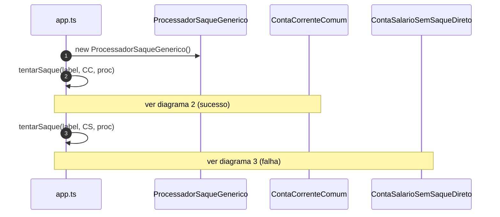

# Diagramas de sequência — exemplo5 (LSP violado)

Fluxos de `src/app.ts`, `tentarSaque` e `ProcessadorSaqueGenerico`. Visualização: [Mermaid](https://mermaid.js.org/).

O chamador assume que qualquer **`ContaBancariaBase`** permite **`debitar`** quando o saldo é suficiente. **`ContaSalarioSemSaqueDireto`** quebra essa expectativa — **anti-LSP**.

---

## 1. `main` e duas tentativas de saque genérico



---

## 2. `tentarSaque` com conta corrente (substituição esperada)

```mermaid
sequenceDiagram
    autonumber
    participant App as tentarSaque
    participant Conta as ContaCorrenteComum
    participant Proc as ProcessadorSaqueGenerico

    App->>Conta: obterSaldoCentavos()
    Conta-->>App: 50000
    App->>Proc: executar(conta, 100)
    Proc->>Proc: validar valor; centavos = 10000
    Proc->>Conta: debitar(10000)
    Conta->>Conta: validar débito; saldo -= 10000
    Proc-->>App: (retorno void)
    App->>Conta: obterSaldoCentavos() após sucesso
```

---

## 3. `tentarSaque` com conta salário (subtipo que surpreende o chamador)

```mermaid
sequenceDiagram
    autonumber
    participant App as tentarSaque
    participant Conta as ContaSalarioSemSaqueDireto
    participant Proc as ProcessadorSaqueGenerico
    participant Out as console

    App->>Conta: obterSaldoCentavos()
    Conta-->>App: 50000
    App->>Proc: executar(conta, 100)
    Proc->>Proc: validar valor; centavos = 10000
    Proc->>Conta: debitar(10000)
    Conta-->>Proc: throw Error (saque não permitido)
    Proc-->>App: exceção
    App->>Out: log "Falha inesperada para quem assumiu LSP"
```

---

## Leitura rápida

- O **tipo** `ContaBancariaBase` **promete** a operação `debitar`, mas um subtipo **não a honra** de forma substituível — o cliente genérico só descobre em **runtime**.
- No **exemplo6**, contas que não devem receber saque por débito **não** entram no contrato **`ContaDebitavel`**, evitando essa armadilha na modelagem.
