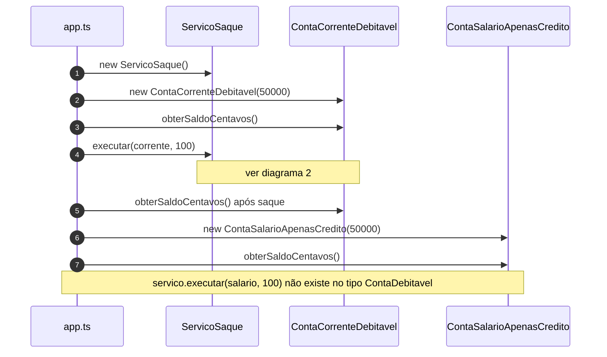

# Diagramas de sequência — exemplo6 (LSP na modelagem)

Fluxos de `src/app.ts` e `ServicoSaque`. Visualização: [Mermaid](https://mermaid.js.org/).

**`ServicoSaque`** só aceita **`ContaDebitavel`**. **`ContaSalarioApenasCredito`** nunca é passada ao serviço — o uso incorreto é **rejeitado pelo compilador**, não por exceção após assumir uma hierarquia única demais.

---

## 1. `main`: saque apenas na conta corrente



---

## 2. Fluxo `ServicoSaque.executar` (conta que implementa `ContaDebitavel`)

```mermaid
sequenceDiagram
    autonumber
    participant App as app.ts
    participant Svc as ServicoSaque
    participant Conta as ContaCorrenteDebitavel

    App->>Svc: executar(conta, valorReais)
    Svc->>Svc: validar valor finito e > 0
    Svc->>Svc: centavos = round(valorReais * 100)
    Svc->>Conta: debitar(centavos)
    Conta->>Conta: validar débito; saldo -= centavos
    Svc-->>App: (retorno void)
```

---

## Leitura rápida

- **Contrato estreito**: só objetos que **realmente** suportam débito entram em `ServicoSaque`. Outra implementação de **`ContaDebitavel`** pode substituir **`ContaCorrenteDebitavel`** sem surpresa (LSP no protocolo certo).
- **Conta salário**: permanece em **`ContaComSaldo`** (crédito / consulta de saldo), sem fingir ser debitável para o caso de uso de saque.
