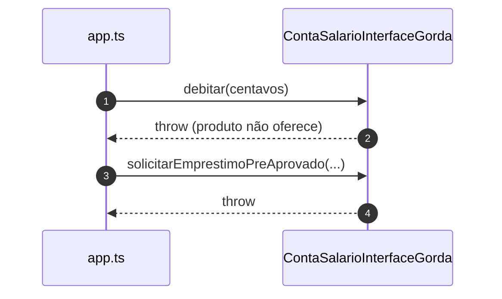

# Diagramas de sequência — exemplo7 (ISP violado)

Fluxos de `src/app.ts` e `ServicoLinhaExtrato` tipado com **`ContaTodasOperacoes`**. Visualização: [Mermaid](https://mermaid.js.org/).

---

## 1. Emissão de linha de extrato (usa só saldo; tipo exige contrato gordo)

```mermaid
sequenceDiagram
    autonumber
    participant App as app.ts
    participant Ext as ServicoLinhaExtrato
    participant Conta as ContaTodasOperacoes

    App->>Ext: formatar(conta, rotulo)
    Ext->>Conta: obterSaldoCentavos()
    Conta-->>Ext: centavos
    Ext-->>App: string formatada
    Note over Ext,Conta: Implementação real só precisa de saldo; o tipo ainda acopla débito / empréstimo / bloqueio.
```

---

## 2. Conta salário e o “resto” do contrato (métodos artificiais)



---

## Leitura rápida

- **Cliente** de extrato arrasta dependência conceitual de operações que **nunca chama**.
- **Implementador** de conta simples cumpre a interface com **surpresas** (`throw`). No **exemplo8**, o mesmo extrato depende só de **`ContaConsultavel`**.
