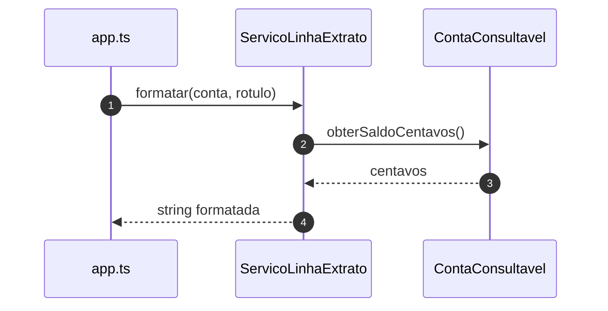

# Diagramas de sequência — exemplo8 (ISP)

Fluxos de `src/app.ts`, **`ServicoLinhaExtrato`** (`ContaConsultavel`) e **`ServicoSaque`** (`ContaDebitavel`). Visualização: [Mermaid](https://mermaid.js.org/).

---

## 1. Linha de extrato (contrato mínimo)



---

## 2. Saque (contrato de débito)

```mermaid
sequenceDiagram
    autonumber
    participant App as app.ts
    participant Svc as ServicoSaque
    participant D as ContaDebitavel

    App->>Svc: executar(conta, valorReais)
    Svc->>Svc: validar valor; centavos
    Svc->>D: debitar(centavos)
    D-->>Svc: ok
```

---

## Leitura rápida

- **`ContaSalarioCreditoFolha`** entra em `formatar` (é **`ContaConsultavel`**), mas **não** em `ServicoSaque.executar` — não há obrigação de implementar capacidades do multiproduto.
