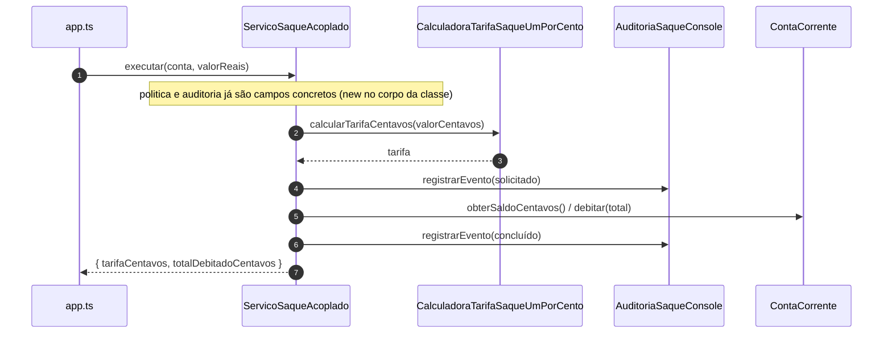

# Diagramas de sequência — exemplo9 (DIP violado)

Fluxo de `src/app.ts` → **`ServicoSaqueAcoplado`**, com dependências **criadas dentro** do serviço. Visualização: [Mermaid](https://mermaid.js.org/).

---

## 1. `ServicoSaqueAcoplado.executar`

---

## Leitura rápida

- **Alto nível** acoplou-se a **nomes de classes** de infraestrutura. Testes e extensões costumam exigir **mudar** o serviço ou contornar com hacks.
- No **exemplo10**, o mesmo fluxo invoca **`PoliticaEncargoSaque`** e **`PortaAuditoriaSaque`**: detalhes plugáveis.
